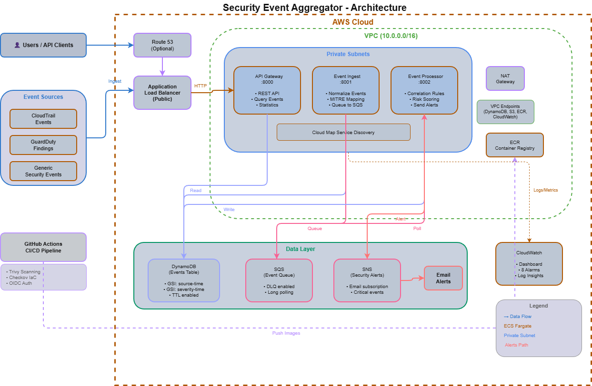

# Security Event Aggregator

A containerized microservices architecture for aggregating, normalizing, and analyzing security events from multiple AWS sources. Built with Python FastAPI, Docker, and designed for deployment on AWS ECS Fargate.



## Overview

The Security Event Aggregator demonstrates enterprise-grade container orchestration and security event processing patterns. It ingests security events from multiple sources (CloudTrail, GuardDuty), normalizes them to a common schema with MITRE ATT&CK mapping, correlates related events to detect attack patterns, and sends real-time alerts for high-severity incidents.

### Key Features

- **Multi-source Event Ingestion**: CloudTrail, GuardDuty, and custom security events
- **MITRE ATT&CK Mapping**: Automatic classification of security events to MITRE framework
- **Event Correlation**: Pattern detection for brute force, privilege escalation, and more
- **Risk Scoring**: Dynamic risk calculation based on severity and correlation
- **Real-time Alerting**: SNS notifications for high-severity events
- **Containerized Architecture**: Production-ready Docker images with multi-stage builds
- **Service Discovery**: AWS Cloud Map integration for inter-service communication

## Architecture

```
┌─────────────────────────────────────────────────────────────────────────────┐
│                              VPC (10.0.0.0/16)                              │
│  ┌────────────────────────────────────────────────────────────────────────┐ │
│  │                         Public Subnets                                 │ │
│  │  ┌─────────────────┐                                                   │ │
│  │  │       ALB       │◄──────── Internet Traffic                         │ │
│  │  └────────┬────────┘                                                   │ │
│  └───────────┼────────────────────────────────────────────────────────────┘ │
│              │                                                              │
│  ┌───────────┼────────────────────────────────────────────────────────────┐ │
│  │           │              Private Subnets                               │ │
│  │           ▼                                                            │ │
│  │  ┌─────────────────┐    ┌─────────────────┐    ┌─────────────────┐     │ │
│  │  │   API Gateway   │───▶│  Event Ingest   │───▶│  Event Processor│     │ │
│  │  │    Service      │    │    Service      │    │    Service      │     │ │
│  │  │  (Port 8000)    │    │  (Port 8001)    │    │  (Port 8002)    │     │ │
│  │  └────────┬────────┘    └────────┬────────┘    └────────┬────────┘     │ │
│  │           │                      │                      │              │ │
│  │           └──────────────────────┼──────────────────────┘              │ │
│  │                                  │                                     │ │
│  │                                  ▼                                     │ │
│  │                    ┌─────────────────────────┐                         │ │
│  │                    │    AWS Cloud Map        │                         │ │
│  │                    │  (Service Discovery)    │                         │ │
│  │                    └─────────────────────────┘                         │ │
│  └────────────────────────────────────────────────────────────────────────┘ │
│                                                                             │
│  ┌─────────────────────────────────────────────────────────────────────────┐│
│  │                         Data Layer                                      ││
│  │  ┌──────────────┐  ┌──────────────┐  ┌──────────────┐                  ││
│  │  │  DynamoDB    │  │     SQS      │  │     SNS      │                  ││
│  │  │  (Events)    │  │   (Queue)    │  │   (Alerts)   │                  ││
│  │  └──────────────┘  └──────────────┘  └──────────────┘                  ││
│  └─────────────────────────────────────────────────────────────────────────┘│
└─────────────────────────────────────────────────────────────────────────────┘
```

## Microservices

### 1. API Gateway Service (Port 8000)
External-facing REST API for querying security events.

**Endpoints:**
- `GET /events` - List events with filters
- `GET /events/{id}` - Get specific event
- `GET /events/stats` - Dashboard statistics
- `POST /events/search` - Advanced search
- `GET /health` - Health check

### 2. Event Ingest Service (Port 8001)
Receives and normalizes security events from various sources.

**Endpoints:**
- `POST /ingest/cloudtrail` - Ingest CloudTrail events
- `POST /ingest/guardduty` - Ingest GuardDuty findings
- `POST /ingest/generic` - Ingest custom events
- `GET /health` - Health check

### 3. Event Processor Service (Port 8002)
Async processing, correlation, and alerting.

**Features:**
- SQS message polling
- Event correlation patterns
- Risk score calculation
- SNS alert triggering

## Quick Start

### Prerequisites
- Docker and Docker Compose
- Python 3.11+ (for running tests)
- AWS CLI (optional, for LocalStack interaction)

### Local Development

1. **Clone and navigate to project:**
   ```bash
   cd security-event-aggregator
   ```

2. **Start all services:**
   ```bash
   docker-compose up -d
   ```

3. **Wait for services to be ready (~30 seconds):**
   ```bash
   docker-compose logs -f
   ```

4. **Run integration tests:**
   ```bash
   pip install requests
   python test_services.py
   ```

5. **Explore the APIs:**
   - API Gateway: http://localhost:8000/docs
   - Event Ingest: http://localhost:8001/docs
   - Event Processor: http://localhost:8002/docs

### Sample API Calls

**Ingest a CloudTrail event:**
```bash
curl -X POST http://localhost:8001/ingest/cloudtrail \
  -H "Content-Type: application/json" \
  -d '{
    "events": [{
      "eventName": "ConsoleLogin",
      "eventSource": "signin.amazonaws.com",
      "userIdentity": {"type": "IAMUser", "userName": "alice"},
      "sourceIPAddress": "203.0.113.50",
      "eventTime": "2024-01-15T10:30:00Z"
    }]
  }'
```

**Query events:**
```bash
curl http://localhost:8000/events?severity=high
```

**Get statistics:**
```bash
curl http://localhost:8000/events/stats
```

## Event Schema

All events are normalized to a common schema:

```json
{
  "event_id": "uuid",
  "source": "cloudtrail|guardduty|custom",
  "event_time": "2024-01-15T10:30:00Z",
  "event_type": "ConsoleLogin",
  "event_category": "authentication",
  "severity": "critical|high|medium|low|info",
  "title": "CloudTrail: ConsoleLogin",
  "description": "User alice logged in from 203.0.113.50",
  "aws_context": {
    "account_id": "123456789012",
    "region": "us-east-1",
    "service": "signin"
  },
  "actor": {
    "user_name": "alice",
    "principal_type": "IAMUser"
  },
  "network": {
    "source_ip": "203.0.113.50"
  },
  "mitre_attack": {
    "tactic": "Initial Access",
    "technique_id": "T1078",
    "technique_name": "Valid Accounts"
  }
}
```

## Correlation Patterns

The Event Processor detects these attack patterns:

| Pattern | Description | Events |
|---------|-------------|--------|
| Brute Force | Multiple failed login attempts | 5+ ConsoleLogin failures in 15 min |
| Privilege Escalation | IAM changes after login | ConsoleLogin → CreateAccessKey |
| Logging Tampering | CloudTrail modifications | StopLogging, DeleteTrail |
| Reconnaissance | Discovery API enumeration | 20+ List/Describe calls in 10 min |

## MITRE ATT&CK Mapping

Events are automatically mapped to MITRE ATT&CK:

| Event Type | Tactic | Technique |
|------------|--------|-----------|
| ConsoleLogin | Initial Access | T1078 - Valid Accounts |
| CreateAccessKey | Persistence | T1098.001 - Additional Cloud Credentials |
| StopLogging | Defense Evasion | T1562.008 - Disable Cloud Logs |
| GetSecretValue | Credential Access | T1555 - Credentials from Password Stores |

## Project Structure

```
security-event-aggregator/
├── services/
│   ├── api-gateway/
│   │   ├── Dockerfile
│   │   ├── requirements.txt
│   │   └── src/
│   │       ├── main.py
│   │       ├── routes/events.py
│   │       ├── models/events.py
│   │       └── utils/dynamodb.py
│   ├── event-ingest/
│   │   ├── Dockerfile
│   │   ├── requirements.txt
│   │   └── src/
│   │       ├── main.py
│   │       ├── normalizers/
│   │       │   ├── cloudtrail.py
│   │       │   └── guardduty.py
│   │       └── models/events.py
│   └── event-processor/
│       ├── Dockerfile
│       ├── requirements.txt
│       └── src/
│           ├── main.py
│           ├── correlators/correlator.py
│           ├── alerting/alerts.py
│           └── models/events.py
├── terraform/
│   ├── environments/dev/
│   └── modules/
│       ├── vpc/
│       ├── ecr/
│       ├── ecs/
│       ├── alb/
│       ├── dynamodb/
│       ├── sqs/
│       └── monitoring/
├── .github/workflows/
│   └── deploy.yml
├── docker-compose.yml
├── localstack-init/
│   └── init-aws.sh
├── test_services.py
└── README.md
```

## AWS Deployment

See [terraform/README.md](terraform/README.md) for full deployment instructions.

### Quick Deploy

```bash
cd terraform/environments/dev
terraform init
terraform plan
terraform apply
```

### Required AWS Resources
- VPC with public/private subnets
- ECS Cluster (Fargate)
- ECR Repositories (3)
- Application Load Balancer
- DynamoDB Table
- SQS Queue
- SNS Topic
- IAM Roles and Policies
- Security Groups
- Cloud Map Namespace

## Security Features

- **Network Isolation**: Services run in private subnets
- **Least Privilege IAM**: Minimal permissions per service
- **Non-root Containers**: All containers run as non-root user
- **Secrets Management**: AWS Secrets Manager integration
- **Security Scanning**: Trivy and Checkov in CI/CD
- **Encrypted Data**: DynamoDB encryption at rest

## Skills Demonstrated

- **Containers & Docker**: Multi-stage builds, health checks, non-root users
- **Microservices Architecture**: Service discovery, async messaging, API design
- **AWS Services**: ECS Fargate, DynamoDB, SQS, SNS, ALB, Cloud Map
- **Infrastructure as Code**: Terraform modules and environments
- **CI/CD**: GitHub Actions with OIDC authentication
- **Security**: MITRE ATT&CK, event correlation, threat detection

## License

MIT License - See [LICENSE](LICENSE) for details.

## Author

Built as part of a cloud security engineering portfolio demonstrating containerization and microservices skills.
